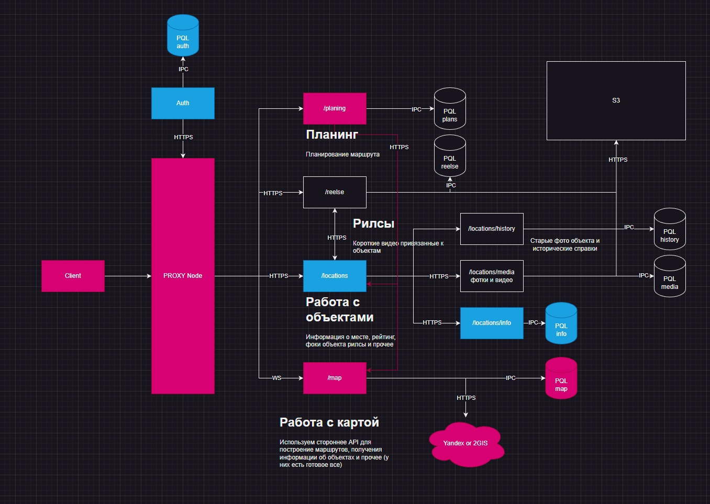

# Сервис proxy node

Является входной точкой в работе системы и прдеставляет из себя обычный `proxy balanser`

Он выполняте следующие функции:

1) сокрытие всех сервисов системы из `public api`
2) распределение нагрузки

Общая схема системы представлена ниже:

На первое время было решено использовать `Nodejs`, так как сервер не выполняет никаких особых вычислений + хорошо должен работать с асинхронным кодом из-за проксирующей логики работы системы

Конфигурация происходит с помощью env файлов

## Стек

1) Nodejs
2) Typescript
3) Express
4) dotenv
